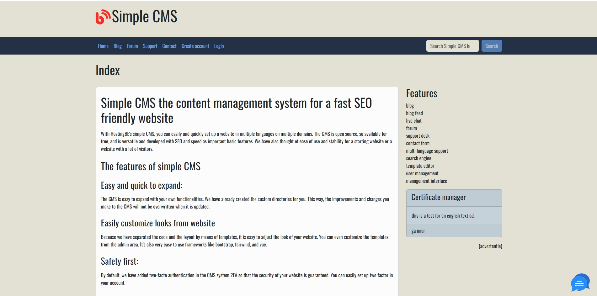

# Simple CMS #

Are you tired of complex __content management systems__ that require endless hours of training and a hefty budget? Look no further! Introducing Simple CMS – the intuitive, open-source content management system crafted in PHP, designed with simplicity and efficiency at its core.

With Simple CMS, you can easily create, edit, and manage your website content without the need for advanced technical skills. Whether you're a small business owner, a blogger, or a web developer, our platform empowers you to take full control of your digital presence

Here’s why Simple CMS stands out:

1. **User-Friendly Interface**: Our streamlined dashboard makes navigating your content a breeze. You can quickly publish new articles, upload images, and manage your pages with just a few clicks.



2. **Lightweight and Fast**: Built on PHP, Simple CMS is optimized for performance. Say goodbye to slow-loading pages and hello to a seamless browsing experience for your visitors.

3. **Fully Customizable**: With open-source flexibility, you can tailor Simple CMS to meet your specific needs. Add features, modify templates, and create a unique website that reflects your brand’s identity.

4. **Robust Community Support**: Join a growing community of developers and users who are passionate about open-source solutions. With a wealth of resources, forums, and documentation at your fingertips, help is always available when you need it.\n\n


## Howto get started ##
* Clone the repository or download the zip file
* Copy config/config-sample.php to config/config.php and change the settings
* Import the database sql schema from the sql directory in your database
* Run composer update (this will install all dependencies which are needed)
* Run npm i in the public_html directory (this will install all dependencies which are needed)
* Rename htaccess to .htaccess in public_html directory (if it does not exist!)

## Features ##

* Blog
* Contact form
* Roles (visitor/customer/administrator)
* Support wiki (choose enabled/disabled)
* Forum (choose enabled/disabled)
* Highly customizable via seperate TWIG templates
* Multi language (choose enabled/disabled)
* Administration backend
* Website chat (choose enabled/disabled) 

## Crontab ##

Their are several crontab jobs which you can set which will run on the times you specified

The activate reminder script will send reminders to users who did not activate the account yet.
```
0 3 * * * /usr/bin/php /home/username/bin/console.php reminder-email activate-reminder
```

The send-reminders will send reminders to users who are not logged in for a certain count of days (7,30,60)
```
30 3 * * * /usr/bin/php /home/username/bin/console.php reminder-email send-reminders
```

## Website design ##

Design used [https://getbootstrap.com], create a custom SCSS and create the CSS file for your design from bootstrap
