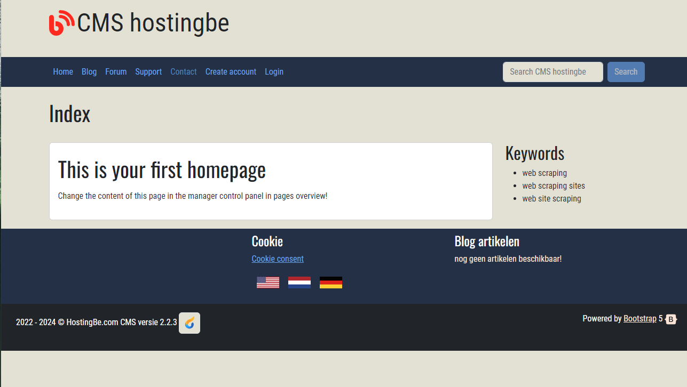

# Simple CMS #

Simple CMS written in PHP with the use of slim 4 framework



## Howto get started ##

* Copy config/config-sample.php to config/config.php and change the settings
* Import the database sql schema from the sql directory
* Run composer update
* Run npm i in the public_html directory
* Rename htaccess to .htaccess in public_html directory

## crontab ##

Their are several crontabs which you can set which will run on the times your specified

The activate reminder script will send reminders to users who did not activate the account yet.
```
0 3 * * * /usr/bin/php /home/username/bin/console.php reminder-email activate-reminder
```

The send-reminders will send reminders to users who are not logged in for a certain count of days (7,30,60)
```
30 3 * * * /usr/bin/php /home/username/bin/console.php reminder-email send-reminders
```

## Website design ##

Design done by [https://getbootstrap.com], create a custom SCSS and create the CSS file for your design
