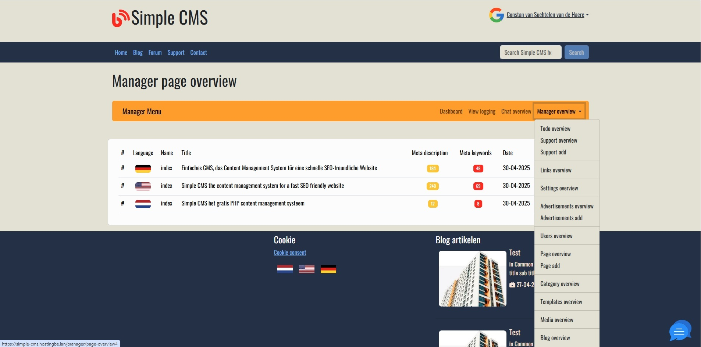

# Simple CMS #

Are you tired of complex __content management systems__ that require endless hours of training and a hefty budget? Look no further! Introducing Simple CMS – the intuitive, open-source content management system crafted in PHP, designed with simplicity and efficiency at its core.

With Simple CMS, you can easily create, edit, and manage your website content without the need for advanced technical skills. Whether you're a small business owner, a blogger, or a web developer, our platform empowers you to take full control of your digital presence

Here’s why Simple CMS stands out:

1. **User-Friendly Interface**: Our streamlined dashboard makes navigating your content a breeze. You can quickly publish new articles, upload images, and manage your pages with just a few clicks.


2. **Lightweight and Fast**: Built on PHP, Simple CMS is optimized for performance. Say goodbye to slow-loading pages and hello to a seamless browsing experience for your visitors.

3. **Fully Customizable**: With open-source flexibility, you can tailor Simple CMS to meet your specific needs. Add features, modify templates, and create a unique website that reflects your brand’s identity.

4. **Robust Community Support**: Join a growing community of developers and users who are passionate about open-source solutions. With a wealth of resources, forums, and documentation at your fingertips, help is always available when you need it.



## Howto get started ##
* Download the install.sh script (wget https://raw.githubusercontent.com/HostingBE/simple-cms/refs/heads/master/install.sh)
* Make install.sh executable (chmod 755)
* Enter the requested values in install.sh
* Run install.sh
* Your all set to go

## Login data ##

At the first time you visit your website an admin account is automaticly created. The username and password are printed in the logfile on the server. The logfile is located in the logs directory and it's name is %d-%m-%Y-app.log.

## Features ##

* Blog
* Contact form
* Roles (visitor/customer/administrator)
* Support wiki (choice enabled/disabled)
* Forum (choice enabled/disabled)
* Highly customizable via seperate TWIG templates
* Multi language (choice enabled/disabled)
* Administration backend
* Website chat (choice enabled/disabled) 
* Online WYSIWYG editor
* Markdown support with TOC (table of contents) generation

## Crontab ##

Their are several crontab jobs which you can set which will run on the times you specified

The activate reminder script will send reminders to users who did not activate the account yet.
```
0 3 * * * /usr/bin/php /home/username/bin/console.php reminder-email activate-reminder
```

The send-reminders will send reminders to users who are not logged in for a certain count of days (7,30,60)
```
30 3 * * * /usr/bin/php /home/username/bin/console.php reminder-email send-reminders
```

## History ##

The first release of Simple CMS for an SEO website was in early May 2022. We use Simple CMS for every website we create, launch, and manage. The foundation is robust and simple, offering all the necessary functionality you'd expect from a CMS.

Of course, every website requires its own unique functionalities, which are integrated into Simple CMS as modules or plugins. The CMS is fully equipped for this, providing a solid foundation for any website.

## Roadmap ##

High on the wish list is an online upgrade option and then an online installer. Expanding online chat capabilities and adding more functionality for uploading media such as photos, videos, and documents.

## Website design ##

Design used [https://getbootstrap.com], create a custom SCSS and create the CSS file for your design from bootstrap
